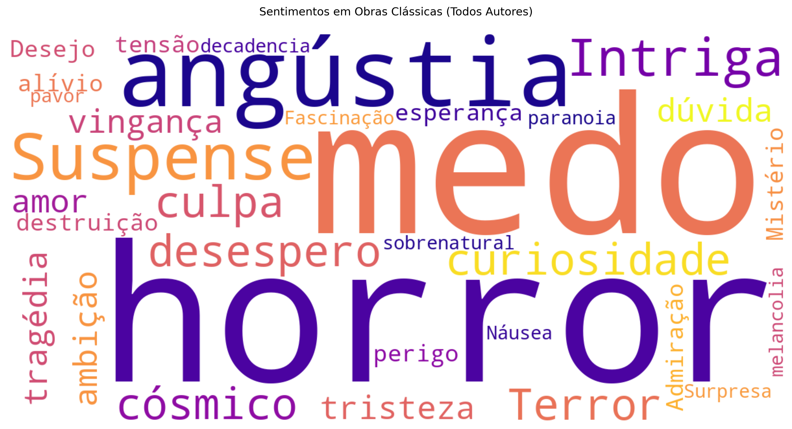

# 🧠 Análise de Sentimentos em Autores Clássicos



Projeto de análise de sentimentos em obras literárias clássicas, utilizando **web scraping** e a **API Gemini** para identificar padrões emocionais característicos de cada autor.

---

## 📌 Visão Geral

Este projeto coleta dados de livros no site [Infolivros](https://www.infolivros.org/), realiza uma análise de sentimentos com apoio da API Gemini e gera visualizações que facilitam a comparação entre estilos e emoções predominantes nos autores analisados.

---

## 📋 Dados Coletados

Para cada obra, são extraídos:

- ✅ Título completo  
- ✅ Autor  
- ✅ Descrição da obra  
- ✅ Link para download do PDF  
- ✅ URL da imagem da capa  
- ✅ **Top 3 sentimentos** identificados via API  

**🔍 Exemplo:**
```json
{
  "autor": "William Shakespeare",
  "titulo": "1) Hamlet",
  "descricao": "Hamlet é uma história sobre como o fantasma de um rei assassinado...",
  "link_download": "https://dl.dropboxusercontent.com/.../Hamlet.pdf",
  "imagem_capa": "https://www.infolivros.org/.../Hamlet.jpg",
  "sentimentos": ["vingança", "tristeza", "dúvida"]
}
```

---

## 📊 Resultados Gerados

### 🔥 Visualizações

- **Heatmap de Sentimentos**: Frequência por autor  
- **Radar de Comparação**: Perfil emocional geral  
- **Nuvens de Palavras**:  
  - Geral  
  - Por autor:  
    - Agatha Christie  
    - Edgar Allan Poe  
    - H.P. Lovecraft  
    - Irmãos Grimm  
    - William Shakespeare  

### 📝 Relatório Textual (`insights_autores.txt`)

Inclui:

- Top 3 sentimentos por autor  
- Comparações entre os autores  
- Análise geral das obras  

---

## 🛠️ Tecnologias Utilizadas

- **Linguagem**: Python 3.8+  
- **Web Scraping**: BeautifulSoup  
- **Análise de Sentimentos**: API Gemini  
- **Visualizações**: Matplotlib, Seaborn, WordCloud  

---

## 🚀 Como Executar

### 1. Instale as dependências:

```bash
pip install -r requirements.txt
```

### 2. Configure sua chave da API Gemini:

Crie um arquivo `.env` com o seguinte conteúdo:

```env
GEMINI_API_KEY=sua_chave_aqui
```

### 3. Execute o projeto:

```bash
python app.py
```

---

## 📂 Estrutura do Projeto

```
insights-livros-classicos/
├── app.py                   # Código principal
├── requirements.txt         # Dependências
├── .env                     # Configuração da API (não versionado)
├── livros_analisados.json   # Dados completos
│
├── insights/
│   ├── heatmap_sentimentos.png
│   ├── radar_sentimentos.png
│   └── insights_autores.txt
│
└── nuvens/
    ├── nuvem_geral.png
    ├── nuvem_agatha_christie.png
    ├── nuvem_edgar_allan_poe.png
    ├── nuvem_h.p_lovecraft.png
    ├── nuvem_irmãos_grimm.png
    └── nuvem_william_shakespeare.png
```

---

## 🧪 Metodologia

### 🔹 Coleta
- Acesso automatizado ao site Infolivros  
- Extração de informações por obra  

### 🔹 Análise
- Identificação dos **3 principais sentimentos** por obra  
- Processamento com API Gemini  

### 🔹 Visualização
- Geração de gráficos e nuvens de palavras para explorar os padrões emocionais  

---

## 🌟 Autores Analisados

- William Shakespeare  
- Irmãos Grimm  
- H.P. Lovecraft  
- Edgar Allan Poe  
- Agatha Christie  

---

## 🤝 Contribuição

Contribuições são bem-vindas!  
Abra uma *issue* ou envie um *pull request* com melhorias e sugestões.

## Autores

João Felipe S. | [GitHub](https://github.com/jfsjao)

Ian Seki | [GitHub](https://github.com/ibSeki)
